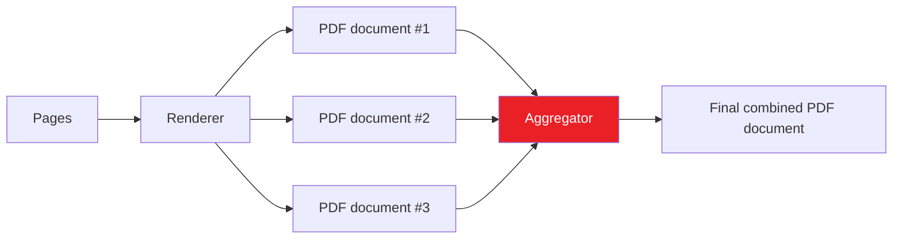

# Generating PDF documents

## Prerequisites

Under-the-hood, this library depends on a web browser controlled by *Playwright* to generate PDF documents.

At the time of writing, *Playwright* has the following requirements:

- **Python**
  - Version 3.9 or higher
- **Operating system**
  - Windows 10+, Windows Server 2016+ or Windows Subsystem for Linux (WSL)
  - macOS 12 *Monterey*, macOS 13 *Ventura* or macOS 14 *Sonoma*
  - Debian 11, Debian 12, Ubuntu 20.04 or Ubuntu 22.04, with `x86-64` or `arm64` architecture

???+ question "Is your operating system not compatible?"

    You can use *Docker* to build your documentation from any operating system.  
    Feel free to explore the [Dockerfile](https://github.com/adrienbrignon/mkdocs-exporter/blob/master/Dockerfile) used by this documentation for guidance.

To install the browser and its required dependencies, run:

```bash
playwright install chrome --with-deps
```

## Configuration

Inside your `mkdocs.yml` configuration file, make sure to enable the PDF format:

```yaml
plugins:
  - exporter:
      formats:
        pdf:
          enabled: !ENV [MKDOCS_EXPORTER_PDF_ENABLED, true]
```

With this configuration, the `MKDOCS_EXPORTER_PDF_ENABLED` environment variable can be used as a toggle for the generation process.  
By default, PDF documents will be generated.

### Controlling PDF generation

In *MkDocs Exporter*, you can control whether a specific Markdown file should be included in the PDF generation process using the front matter configuration.  
This feature provides flexibility in managing which documents are exported to PDF format based on your project's requirements.

#### Enabling PDF generation

???+ info
    By default, all pages are included in the PDF generation process.

If you enable the explicit mode in your configuration, you'll have to explicitly enable PDF generation for your pages.  
This explicit configuration ensures that each page's inclusion in the PDF output is deliberate and controlled.

```yaml
plugins:
  - exporter:
      formats:
        pdf:
          explicit: true
```

To enable PDF generation for a specific page, add the following front matter at the beginning of the file:

```yaml
---
pdf: true
---
```

#### Disabling PDF generation

Conversely, if you want to exclude a pages from the PDF generation process, you can specify:

```yaml
---
pdf: false
---
```

*MkDocs Exporter* will skip including this file when creating PDF documents.  
This capability allows you to manage and customize the content that appears in your PDF exports with precision.


#### Enhancing performance with concurrency

Concurreny enhances the efficiency of PDF generation by enabling the plugin to utilize multiple threads concurrently.  
This means that instead of processing one page at a time sequentially, the plugin can distribute the workload across multiple threads, thereby speeding up the generation process significantly.

This option is particularly beneficial for larger documentation projects with numerous pages.

```yaml
plugins:
  - exporter:
      formats:
        pdf:
          concurrency: 16
```

This configuration instructs *MkDocs Exporter* to generate up to 16 PDF documents concurrently.

### Cover pages

In this section, you will learn how to configure and customize cover pages for your PDF documents using the *MkDocs Exporter* plugin.  
Cover pages add a professional touch to your documentation and can include titles, authors, dates, logos, and other relevant information.

???+ tip "Unleashing the power of templates"

    The following examples use the [`macros`](https://github.com/fralau/mkdocs_macros_plugin) plugin to introduce templating into pages.

    While using macros can enhance the customization of your cover pages, it is purely facultative.  
    You can achieve a fully functional and visually appealing cover pages using standard Markdown without the need for additional plugins.

#### Global cover pages

The *MkDocs Exporter* plugin allows you to define global cover pages that apply to your entire documentation project.
This ensures a consistent look and feel across all your PDF documents without needing to set up cover pages individually for each file.

=== "`mkdocs.yml`"

    ```yaml
    plugins:
      - exporter:
        formats:
          pdf:
            stylesheets:
              - resources/stylesheets/pdf.scss
            covers:
              front: resources/templates/covers/front.html.j2
              back: resources/templates/covers/back.html.j2
    ```

    > :material-file-code: View the full content of this file [here](https://github.com/adrienbrignon/mkdocs-exporter/blob/master/mkdocs.yml).

=== "`resources/templates/covers/front.html.j2`"

    ```html
    <div class="front-cover">
      
      <section>
        <div class="brand">{{ config.site_name }}</div>
        <div class="title">{{ page.title }}</div>
      </section>
    </div>
    ```

    > :material-file-code: View the full content of this file [here](https://github.com/adrienbrignon/mkdocs-exporter/blob/master/resources/templates/covers/front.html.j2).

=== "`resources/templates/covers/back.html.j2`"

    ```html
    <div class="back-cover">
      <section>
        <div class="title">{{ config.site_name }}</div>
      </section>
    </div>
    ```

    > :material-file-code: View the full content of this file [here](https://github.com/adrienbrignon/mkdocs-exporter/blob/master/resources/templates/covers/back.html.j2).

=== "`resources/stylesheets/pdf.scss`"

    ```scss
    @page {
      size: A4;
      margin: 1.20cm;
    }
    ```

    > :material-file-code: View the full content of this file [here](https://github.com/adrienbrignon/mkdocs-exporter/blob/master/resources/stylesheets/pdf.scss).

If you use the template **front cover page**, do not forget to copy the  [background image](https://raw.githubusercontent.com/adrienbrignon/mkdocs-exporter/master/docs/assets/images/background.png)  `docs/assets/images/background.png` to your project.

#### Per-page cover pages

While global cover pages provide a uniform look across your documentation, you can override them on a per-page basis using front matter.  
This flexibility allows you to customize cover pages for specific documents when needed.

```markdown
---
covers:
  front: ./resources/templates/covers/special.html.j2
---

# My special page

This configuration specifies a custom front cover page template located at `./resources/templates/covers/special.html.j2` for this page.  
You can follow the same operation to specify a custom back cover page.
```

#### Hiding cover pages

In some cases, you might want to hide cover pages for specific documents within your project.

The *MkDocs Exporter* plugin allows you to easily hide cover pages on a per-page basis using the front matter in your Markdown files.
This flexibility ensures that you can maintain a clean and streamlined appearance for certain pages without the need for cover pages.

```markdown
---
hidden:
  - covers
---

# Appendix A

This appendix contains supplementary information but wont have cover pages...
```

### Buttons

#### Adding a download button

To provide users with the ability to download your page as a PDF document, you can set up a download button using the *MkDocs Exporter* plugin.  
This section outlines the configuration needed in your `mkdocs.yml` file to enable and customize the download button.

```yaml
plugins:
  - exporter:
      buttons:
        - title: Download as PDF
          icon: material-file-download-outline
          enabled: !!python/name:mkdocs_exporter.formats.pdf.buttons.download.enabled
          attributes: !!python/name:mkdocs_exporter.formats.pdf.buttons.download.attributes
```

<div class="page-break-after"></div>

### Combining pages into a single PDF document

In *MkDocs Exporter*, the aggregator feature allows you to consolidate multiple individual PDF documents into a single cohesive PDF file.  
This functionality is particularly useful for compiling comprehensive documentation or reports where it's beneficial to have all content consolidated into one easily distributable format.



Here's how you can set it up in your `mkdocs.yml` configuration file:

```yaml
plugins:
  - exporter:
      formats:
        pdf:
          aggregator:
            enabled: true
            output: documentation.pdf
            covers: all
```

#### Configuring cover pages behavior

When aggregating PDF documents, you have the flexibility to configure the behavior of cover pages to suit your needs.  
There are five available options for managing cover pages:

- `all` (*default*): retains every cover page from all documents.
- `none`: removes every cover page from the aggregated document, resulting in a compilation that includes only the main content of each PDF.
- `limits`: retains the front cover of the first document and the back cover of the last document, while removing all other cover pages in between.
- `book`: retains the front cover of the first document and the back cover of the last document, while keeping only the front cover pages in between.
- `front`: preserves every front cover page from all documents but removes all back cover pages.
- `back`: preserves every back cover page from all documents but removes all front cover pages.

Choose the behavior that best aligns with your document aggregation needs to ensure the final PDF meets your requirements.
