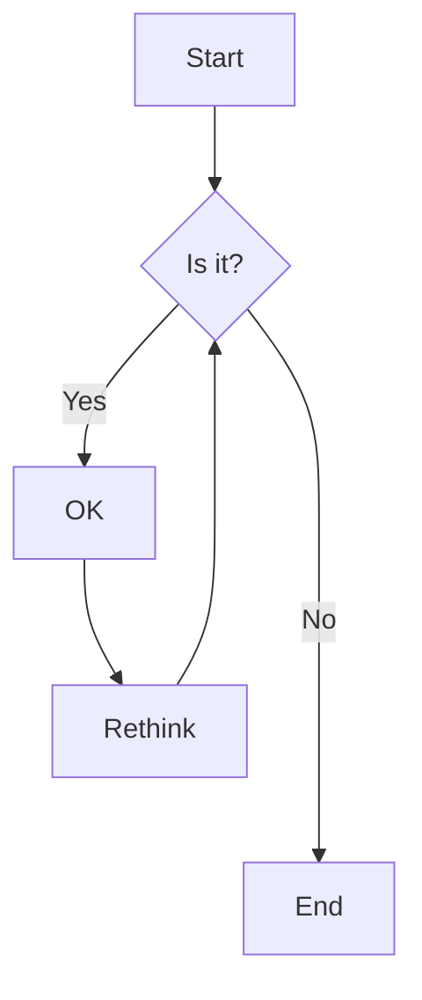
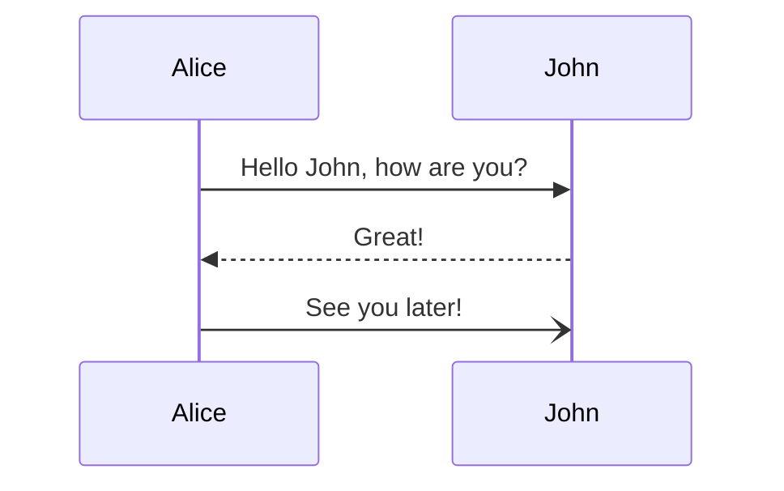
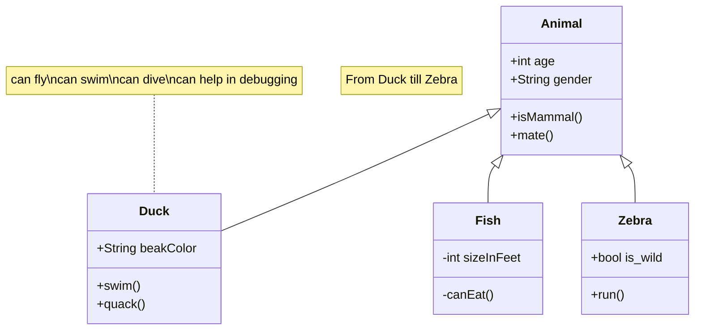
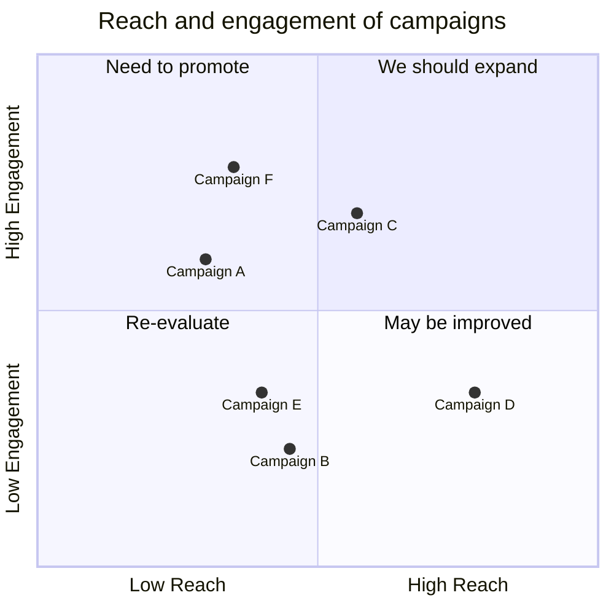

---
buttons:
  - title: Documentation
    icon: material-book-outline
    attributes:
      class: md-content__button md-icon
      href: https://squidfunk.github.io/mkdocs-material/reference/diagrams/
      target: _blank
---

# Diagrams

## Mermaid

Check out [Mermaid's documentation](https://mermaid.js.org/intro/) for a reference of all supported diagrams.

### Flowchart

Pellentesque nec lacus est. Phasellus pulvinar volutpat nisl aliquet auctor.  
Nunc tincidunt molestie mi, et porttitor lectus congue in. Aliquam eu tortor viverra libero imperdiet suscipit. 

Phasellus auctor consectetur diam et ullamcorper. Ut vel lacus massa. Quisque magna magna, semper quis feugiat at, lobortis non leo. Quisque vitae sollicitudin ex. Nulla ut laoreet purus, ut porttitor dui. Suspendisse et ornare erat. Nam id ornare lorem.

Nam quam justo, commodo eu lobortis vestibulum, molestie sed dolor.

### Sequence diagram

Morbi justo enim, rhoncus nec dictum vitae, porttitor ac odio. Pellentesque ac malesuada neque, quis mollis purus.
Aliquam interdum, est a mattis vestibulum, nibh nisl pulvinar orci, a faucibus ante massa et diam.

Phasellus sed velit ex. Proin condimentum dolor ac felis pellentesque imperdiet. Nulla porta est lacus.
Cursus tincidunt cursus diam, sit amet condimentum risus convallis scelerisque.

### Class diagram

Integer iaculis in sem in porttitor. Duis tempus ullamcorper purus, ac efficitur massa aliquam sed. Nam et varius diam. Duis suscipit ultrices odio, non volutpat elit bibendum a. In sit amet ultrices metus. Pellentesque vitae malesuada libero. Phasellus tincidunt cursus diam, sit amet condimentum risus convallis scelerisque. Donec eu luctus tellus, ac porta ex. Nullam dictum eros a consectetur posuere. Donec sed ligula auctor diam faucibus pulvinar nec ut erat. Integer accumsan laoreet mollis. Pellentesque habitant morbi tristique senectus et netus et malesuada fames ac turpis egestas. Aliquam pellentesque tempor pulvinar.

Nullam dictum eros a consectetur posuere. Donec sed ligula auctor diam faucibus pulvinar nec ut erat. Integer accumsan laoreet mollis.  
Pellentesque habitant morbi tristique senectus et netus et malesuada fames ac turpis egestas. Aliquam pellentesque tempor pulvinar.

### Quadrant chart

Duis in consectetur metus, sed vestibulum orci. Quisque tincidunt, nunc eu tincidunt volutpat, risus mi ultricies elit, nec malesuada est ipsum eu lacus. Suspendisse vitae neque pulvinar, tristique lectus sit amet, aliquet arcu. Sed mollis tristique lacus non scelerisque. Suspendisse convallis consequat leo id placerat. Morbi sodales bibendum nibh, vitae interdum erat sagittis sed. Morbi consequat vulputate odio nec mollis. Fusce a neque lacus. Morbi lorem tortor, lobortis id magna imperdiet, malesuada euismod velit.

